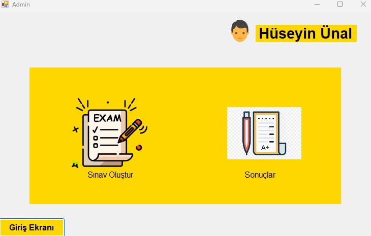
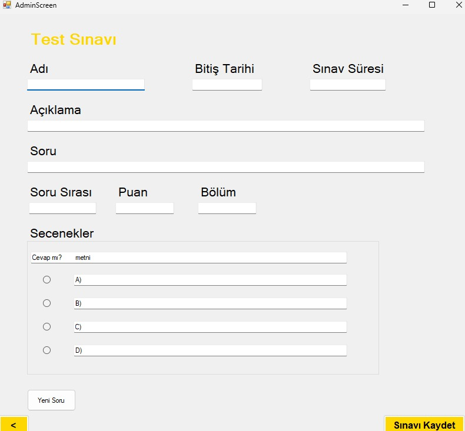
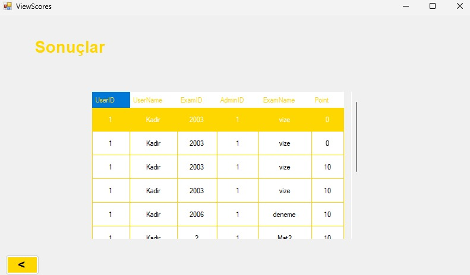

# Exam-Program

**Exam Program - Kadir Pekdemir**

This desktop application allows teachers to create exams, assign them to their students, and view their students' grades. Students can take their exams through this application and see their grades once the exams are completed.

## Ekran Görüntüleri
### Login Page

### Homepage

### Create Exam 

### View Scores


## Installation

### Installation Steps
1. Clone this repository to your local machine:
   ```bash
   git clone https://github.com/yourusername/project-name.git
2. Open the project in Visual Studio or your preferred IDE.

3. Database Connection: Set up SQL Server and configure the connection string accordingly. (The connection string is usually found in the App.config or appsettings.json file).

4. Run the main application file (e.g., ExamScheduler.exe) to start the application.

5. On the first run, the database will be created, and the necessary table structures will be set up automatically.

6. Now you can begin using the application!


##  Technologies

This project is built using the following languages, frameworks, and libraries:

- *C#* – Main programming language used for development
- *.NET Framework 4.7.2* – The framework used to build the application
- *SQL Server* – Used for managing the database
- *Entity Framework* – ORM (Object Relational Mapping) for database interactions
- *WinForms* – For creating the desktop application interface
- *XAML* – For defining the user interface (if applicable)

Other tools and libraries used include:

- *Visual Studio* – The primary IDE for development
- *Git* – For version control
